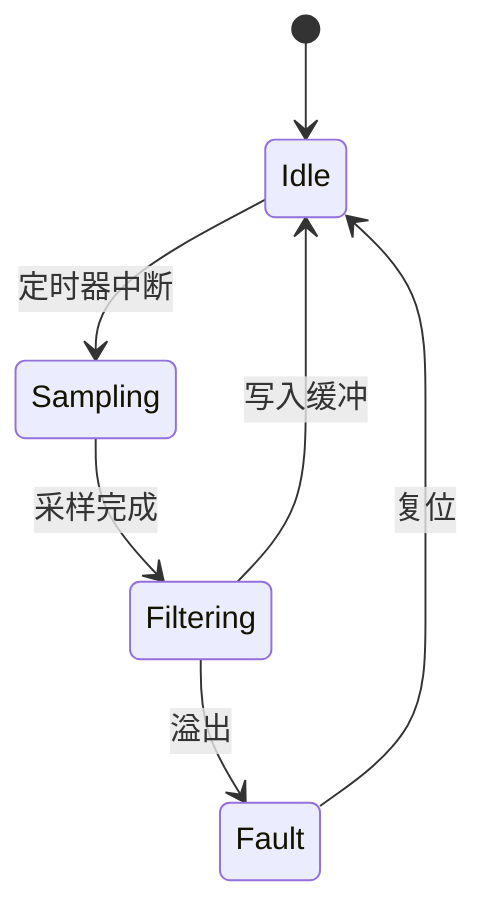

这篇文章是**纯 Markdown**（就像飞书同步下来的样子，没有任何 `import`、没有 JSX）。
但下面的图都是"活"的——因为网页把特定语言的代码块自动渲染成了组件。
**你在飞书里只需插入一个代码块。**

## 1. 状态机（mermaid）

在飞书里插一个 `mermaid` 代码块：



## 2. 总线时序（wavedrom）

一个 `wavedrom` 代码块，画出 SPI 时序：

```wavedrom
{ signal: [
  { name: "SCLK", wave: "p......." },
  { name: "CS",   wave: "10.....1" },
  { name: "MOSI", wave: "x.====x.", data: ["b7","b6","b5","b4"] },
  { name: "MISO", wave: "x.====x.", data: ["r7","r6","r5","r4"] }
]}
```

## 3. 交互式寄存器位域（reg）

一个 `reg` 代码块——**点某一位可以翻转，右下角实时算出寄存器值**：

```reg
{
  "name": "GPIOA_MODER",
  "width": 16,
  "value": "0x0028",
  "fields": [
    { "bits": "1:0", "name": "MODE0" },
    { "bits": "3:2", "name": "MODE1" },
    { "bits": "5:4", "name": "MODE2" },
    { "bits": "7:6", "name": "MODE3" }
  ]
}
```

---

三种图都来自代码块，飞书同步脚本原样搬运、无需改动。**日常在飞书写作，想要活图就插一个代码块**——鱼和熊掌兼得。
