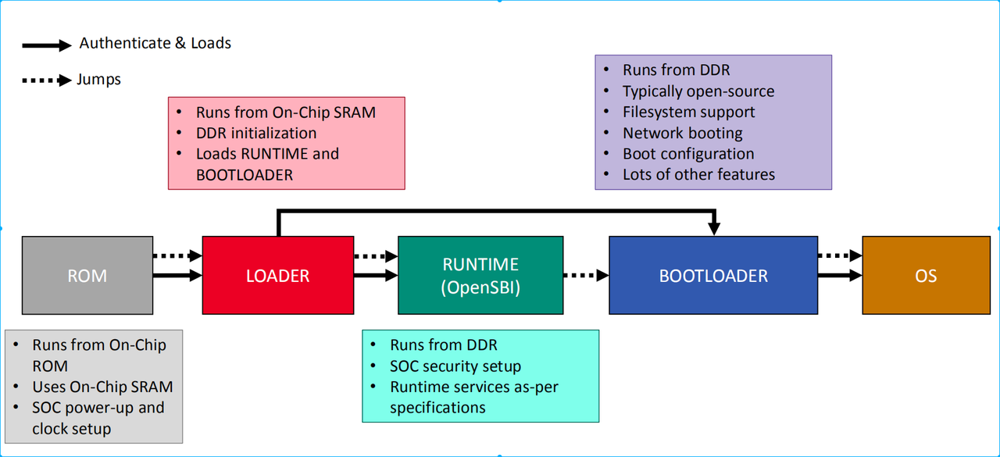
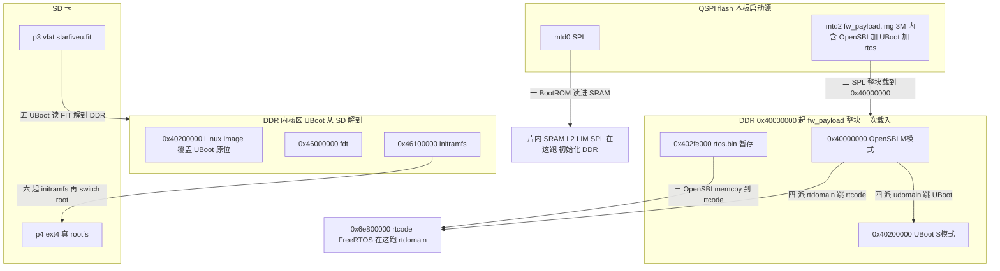

## 参考资料

[JH-7110 Boot User Guide](https://doc-en.rvspace.org/VisionFive2/Boot_UG/)

## boot流程

### 总体启动流程

### 实际启动流程

<figure class="whiteboard"><svg xmlns="http://www.w3.org/2000/svg" viewBox="-1579.1 -911.6 2067.0 1191.9" font-family="-apple-system, 'PingFang SC', 'Microsoft YaHei', 'Noto Sans CJK SC', sans-serif">
<defs><marker id="a" markerWidth="9" markerHeight="9" refX="7" refY="3" orient="auto"><path d="M0,0 L8,3 L0,6 z" fill="context-stroke"/></marker></defs>
<rect x="-1579.1" y="-911.6" width="2067.0" height="1191.9" fill="#ffffff"/>
<rect x="-832.6" y="-780.5" width="222.0" height="74.0" rx="4" fill="#e0eefb" fill-opacity="1" stroke="#3399cc" stroke-width="1.4"/>
<rect x="-1235.8" y="-449.3" width="220.0" height="270.0" rx="4" fill="#faf3f1" fill-opacity="1" stroke="#d9b8ae" stroke-width="1" stroke-dasharray="7 5"/>
<rect x="-1237.8" y="-680.5" width="222.0" height="72.0" rx="4" fill="#fdeee8" fill-opacity="1" stroke="#cc6644" stroke-width="1.4"/>
<rect x="-1520.8" y="-625.9" width="176.8" height="52.0" rx="4" fill="#fff7e6" fill-opacity="1" stroke="#e0a83c" stroke-width="1.4"/>
<text x="-1432.4" y="-605.0" text-anchor="middle"><tspan fill="#d48e5b" font-size="14" font-weight="700">片上SRAM(L2 Cache)</tspan></text>
<text x="-1432.4" y="-585.4" text-anchor="middle"><tspan fill="#d48e5b" font-size="14" font-weight="700">0x0800_0000</tspan></text>
<rect x="-500.1" y="-710.9" width="258.0" height="69.2" rx="4" fill="#e0eefb" fill-opacity="1" stroke="#3399cc" stroke-width="1"/>
<text x="-371.1" y="-670.9" text-anchor="middle"><tspan fill="#333" font-size="16" font-weight="700">rtos.bin: 0x402fe000</tspan></text>
<rect x="-832.6" y="-172.5" width="222.0" height="84.0" rx="4" fill="#fbe5dd" fill-opacity="1" stroke="#cc6644" stroke-width="1.4"/>
<text x="-721.6" y="-124.5" text-anchor="middle"><tspan fill="#d25d5a" font-size="18" font-weight="400">uboot(relocated)</tspan></text>
<rect x="-1421.4" y="142.9" width="24.0" height="24.0" rx="4" fill="#e2f1e7" fill-opacity="1" stroke="#2a9d5a" stroke-width="1.4"/>
<rect x="-1422.1" y="104.8" width="24.0" height="24.0" rx="4" fill="#fbe5dd" fill-opacity="1" stroke="#cc6644" stroke-width="1.4"/>
<rect x="-1421.4" y="184.8" width="24.0" height="24.0" rx="4" fill="#e0eefb" fill-opacity="1" stroke="#3399cc" stroke-width="1.4"/>
<rect x="237.9" y="-398.2" width="222.0" height="302.0" rx="4" fill="#e2f1e7" fill-opacity="1" stroke="#2a9d5a" stroke-width="1"/>
<rect x="-242.1" y="-780.5" width="227.7" height="74.0" rx="4" fill="#e0eefb" fill-opacity="1" stroke="#3399cc" stroke-width="1.4" stroke-dasharray="7 5"/>
<text x="-128.3" y="-747.3" text-anchor="middle"><tspan fill="#5178c6" font-size="16" font-weight="700">Linux Image@0x40200000</tspan></text>
<text x="-128.3" y="-728.0" text-anchor="middle"><tspan fill="#5178c6" font-size="13" font-weight="700">udomain next-addr</tspan></text>
<rect x="-1237.8" y="-780.5" width="222.0" height="102.0" rx="4" fill="#fbe5dd" fill-opacity="1" stroke="#cc6644" stroke-width="1.4"/>
<rect x="-1421.4" y="230.4" width="22.0" height="22.0" rx="4" fill="#eceae4" fill-opacity="1" stroke="#999988" stroke-width="1" stroke-dasharray="7 5"/>
<rect x="-500.1" y="-780.1" width="258.0" height="69.2" rx="4" fill="#e0eefb" fill-opacity="1" stroke="#3399cc" stroke-width="1"/>
<text x="-371.1" y="-747.8" text-anchor="middle"><tspan fill="#5178c6" font-size="16" font-weight="700">U-Boot:0x4020_0000</tspan></text>
<text x="-371.1" y="-730.6" text-anchor="middle"><tspan fill="#d25d5a" font-size="11" font-weight="400">* 重定位后被</tspan><tspan fill="#d25d5a" font-size="11" font-weight="700">Linux Image</tspan><tspan fill="#d25d5a" font-size="11" font-weight="400">@0x40200000覆盖</tspan></text>
<rect x="238.9" y="-787.2" width="220.0" height="100.0" rx="4" fill="#eceae4" fill-opacity="1" stroke="#999988" stroke-width="1" stroke-dasharray="7 5"/>
<rect x="-1237.8" y="-180.5" width="222.0" height="92.0" rx="4" fill="#fdeee8" fill-opacity="1" stroke="#cc6644" stroke-width="1.4"/>
<rect x="-832.6" y="-654.5" width="222.0" height="64.0" rx="4" fill="#e8f1fb" fill-opacity="1" stroke="#3399cc" stroke-width="1.4"/>
<rect x="-832.6" y="-712.5" width="222.0" height="60.0" rx="4" fill="#e8f1fb" fill-opacity="1" stroke="#3399cc" stroke-width="1.4"/>
<rect x="238.9" y="-687.2" width="220.0" height="110.0" rx="4" fill="#eceae4" fill-opacity="1" stroke="#999988" stroke-width="1" stroke-dasharray="7 5"/>
<rect x="237.9" y="-578.2" width="222.0" height="182.0" rx="4" fill="#e2f1e7" fill-opacity="1" stroke="#2a9d5a" stroke-width="1"/>
<rect x="-1520.8" y="-779.3" width="107.0" height="52.0" rx="4" fill="#fff7e6" fill-opacity="1" stroke="#e0a83c" stroke-width="1.4"/>
<text x="-1467.3" y="-758.4" text-anchor="middle"><tspan fill="#d48e5b" font-size="14" font-weight="700">BootROM</tspan></text>
<text x="-1467.3" y="-738.8" text-anchor="middle"><tspan fill="#d48e5b" font-size="14" font-weight="700">0x2A00_0000</tspan></text>
<rect x="-1551.1" y="-534.3" width="232.3" height="122.0" rx="4" fill="none" fill-opacity="0" stroke="#e07b39" stroke-width="1.4" stroke-dasharray="7 5"/>
<text x="-1551.1" y="-507.8" text-anchor="start"><tspan fill="#d48e5b" font-size="14" font-weight="400">②SPL 运行</tspan></text>
<text x="-1551.1" y="-488.2" text-anchor="start"><tspan fill="#d48e5b" font-size="14" font-weight="400">1.拿dtb初始化DDR</tspan></text>
<text x="-1551.1" y="-468.6" text-anchor="start"><tspan fill="#d48e5b" font-size="14" font-weight="400">2.加载fw_payload.img到ddr</tspan></text>
<text x="-1551.1" y="-449.0" text-anchor="start"><tspan fill="#d48e5b" font-size="14" font-weight="400">3.复制rtos.bin</tspan></text>
<text x="-1551.1" y="-429.4" text-anchor="start"><tspan fill="#d48e5b" font-size="14" font-weight="400">4.传递dtb给opensbi, 跳转opensbi</tspan></text>
<rect x="-1237.8" y="-780.5" width="222.0" height="692.0" rx="4" fill="none" fill-opacity="1" stroke="#cc6644" stroke-width="1.4"/>
<rect x="-832.6" y="-326.5" width="222.0" height="162.0" rx="4" fill="#fbe5dd" fill-opacity="1" stroke="#cc6644" stroke-width="1.4"/>
<rect x="-322.9" y="-615.6" width="221.7" height="134.7" rx="4" fill="none" fill-opacity="0" stroke="#509863" stroke-width="1.4" stroke-dasharray="7 5"/>
<text x="-322.9" y="-586.2" text-anchor="start"><tspan fill="#509863" font-size="12" font-weight="400">③内核接管cpu，进行初始化</tspan></text>
<text x="-322.9" y="-571.5" text-anchor="start"><tspan fill="#509863" font-size="10" font-weight="400">1.建早期页表、开MMU、设trap、记dtb</tspan></text>
<text x="-322.9" y="-557.5" text-anchor="start"><tspan fill="#509863" font-size="10" font-weight="400">2. 读a1=0x46000000处的dtb</tspan></text>
<text x="-322.9" y="-543.5" text-anchor="start"><tspan fill="#509863" font-size="10" font-weight="400">3. start_kernel: 初始化+拉核(SMP)</tspan></text>
<text x="-322.9" y="-529.5" text-anchor="start"><tspan fill="#509863" font-size="10" font-weight="400">4. 挂 initramfs 到/ 当过渡根</tspan></text>
<text x="-322.9" y="-515.5" text-anchor="start"><tspan fill="#509863" font-size="10" font-weight="400">5.执行initramfs的/init,等待SD卡就绪,run-init挂载SD卡中的ext4根文件系统</tspan></text>
<text x="-322.9" y="-501.5" text-anchor="start"><tspan fill="#509863" font-size="10" font-weight="400">6.exec /sbin/init=systemd,systemd接管pid1</tspan></text>
<rect x="-499.6" y="-838.9" width="257.5" height="58.7" rx="4" fill="#e0eefb" fill-opacity="1" stroke="#3399cc" stroke-width="1"/>
<text x="-370.9" y="-804.1" text-anchor="middle"><tspan fill="#333" font-size="16" font-weight="700">OpenSBI:0x4000_0000</tspan></text>
<rect x="237.9" y="-788.2" width="222.0" height="692.0" rx="4" fill="none" fill-opacity="1" stroke="#2a9d5a" stroke-width="1"/>
<rect x="-1237.8" y="-610.5" width="222.0" height="162.0" rx="4" fill="#fbe5dd" fill-opacity="1" stroke="#cc6644" stroke-width="1.4"/>
<rect x="-832.6" y="-446.5" width="222.0" height="122.0" rx="4" fill="#fdeee8" fill-opacity="1" stroke="#cc6644" stroke-width="1.4"/>
<rect x="-831.6" y="-591.5" width="220.0" height="46.0" rx="4" fill="#fff3e0" fill-opacity="1" stroke="#cc8833" stroke-width="1" stroke-dasharray="7 5"/>
<rect x="-832.6" y="-546.5" width="222.0" height="102.0" rx="4" fill="#fbe5dd" fill-opacity="1" stroke="#cc6644" stroke-width="1.4"/>
<path d="M-1199.4,183.7 L-1177.4,183.7 L-1155.1,183.7 L-1155.1,183.7 L-1132.8,183.7 L-1110.8,183.7" fill="none" stroke="#509863" stroke-width="1.4" marker-end="url(#a)"/>
<path d="M-242.1,-809.5 L-220.1,-809.5 L-204.0,-809.5 L-204.0,-868.6 L-187.8,-868.6 L-165.8,-868.6" fill="none" stroke="#d4b45b" stroke-width="1.4"/>
<text x="-204.0" y="-839.0" text-anchor="middle" font-size="14" fill="#d48e5b" paint-order="stroke" stroke="#fff" stroke-width="3" stroke-linejoin="round">③opensbi
1.PMP划分地址域和CPU域
2.将各cpu按域发往下一跳</text>
<path d="M-610.6,-622.5 L-588.6,-622.5 L-466.8,-622.5 L-466.8,-548.2 L-344.9,-548.2 L-322.9,-548.2" fill="none" stroke="#509863" stroke-width="1.4" marker-end="url(#a)"/>
<text x="-466.8" y="-585.4" text-anchor="middle" font-size="12" fill="#509863" paint-order="stroke" stroke="#fff" stroke-width="3" stroke-linejoin="round">③.4:临时挂载到/</text>
<path d="M-213.5,-706.5 L-213.5,-684.5 L-213.5,-661.1 L-212.1,-661.1 L-212.1,-637.6 L-212.1,-615.6" fill="none" stroke="#509863" stroke-width="1.4"/>
<path d="M-1432.4,-573.9 L-1432.4,-551.9 L-1432.4,-554.1 L-1435.0,-554.1 L-1435.0,-556.3 L-1435.0,-534.3" fill="none" stroke="#e07b39" stroke-width="1.4" marker-end="url(#a)"/>
<path d="M-1198.8,114.2 L-1176.8,114.2 L-1154.8,114.2 L-1154.8,115.0 L-1132.8,115.0 L-1110.8,115.0" fill="none" stroke="#d4b45b" stroke-width="1.4" marker-end="url(#a)"/>
<path d="M-458.9,-641.7 L-458.9,-619.7 L-458.9,-385.5 L-588.6,-385.5 L-610.6,-385.5" fill="none" stroke="#d4b45b" stroke-width="1.4" marker-end="url(#a)"/>
<text x="-534.8" y="-513.6" text-anchor="middle" font-size="14" fill="#d48e5b" paint-order="stroke" stroke="#fff" stroke-width="3" stroke-linejoin="round">②.3: SPL 搬运  rtos.bin</text>
<path d="M-610.6,-780.5 L-610.6,-802.5 L-610.6,-831.7 L-497.3,-831.7 L-497.3,-860.9 L-497.3,-838.9" fill="none" stroke="#d4b45b" stroke-width="1.4" marker-end="url(#a)"/>
<path d="M-891.1,-369.7 L-891.1,-391.7 L-891.1,-430.1 L-832.5,-430.1 L-832.5,-468.5 L-832.5,-446.5" fill="none" stroke="#8569cb" stroke-width="1.4" marker-end="url(#a)"/>
<text x="-861.8" y="-408.1" text-anchor="middle" font-size="12" fill="#8569cb" paint-order="stroke" stroke="#fff" stroke-width="3" stroke-linejoin="round">①rtdomain的cpu
直接跳转到rtcode入口startup.S执行</text>
<path d="M-500.1,-745.5 L-522.1,-745.5 L-555.4,-745.5 L-555.4,-130.5 L-588.6,-130.5 L-610.6,-130.5" fill="none" stroke="#509863" stroke-width="1.4" marker-end="url(#a)"/>
<text x="-555.4" y="-438.0" text-anchor="middle" font-size="14" fill="#509863" paint-order="stroke" stroke="#fff" stroke-width="3" stroke-linejoin="round">①重定位到高地址</text>
<path d="M-1199.4,149.4 L-1177.4,149.4 L-1156.4,149.4 L-1156.4,149.4 L-1135.3,149.4 L-1113.3,149.4" fill="none" stroke="#8569cb" stroke-width="1.4" marker-end="url(#a)"/>
<path d="M-1015.8,-480.3 L-993.8,-480.3 L-924.2,-480.3 L-924.2,-743.5 L-854.6,-743.5 L-832.6,-743.5" fill="none" stroke="#d4b45b" stroke-width="1.4" marker-end="url(#a)"/>
<text x="-924.2" y="-611.9" text-anchor="middle" font-size="14" fill="#d48e5b" paint-order="stroke" stroke="#fff" stroke-width="3" stroke-linejoin="round">②.2: load img</text>
<path d="M-1413.8,-753.3 L-1391.8,-753.3 L-1325.8,-753.3 L-1325.8,-729.5 L-1259.8,-729.5 L-1237.8,-729.5" fill="none" stroke="#e0a83c" stroke-width="1.4" marker-end="url(#a)"/>
<text x="-1325.8" y="-741.4" text-anchor="middle" font-size="14" fill="#d48e5b" paint-order="stroke" stroke="#fff" stroke-width="3" stroke-linejoin="round">①读 mtd0的spl</text>
<path d="M237.9,-487.2 L215.9,-487.2 L111.7,-487.2 L111.7,-743.5 L7.6,-743.5 L-14.4,-743.5" fill="none" stroke="#509863" stroke-width="1.4" marker-end="url(#a)"/>
<text x="111.7" y="-615.4" text-anchor="middle" font-size="14" fill="#509863" paint-order="stroke" stroke="#fff" stroke-width="3" stroke-linejoin="round">②fatload ：搬运p3的linux.fit到ddr中
1.内核Image, 设备树fdt, initramfs搬运
2.给内核dtb打补丁：失能cpu4, 加一段reserved-memory圈掉amp carveout
3.控制权给kernel(a0传pc，a1传dtb)</text>
<path d="M-1237.8,-729.5 L-1259.8,-729.5 L-1432.4,-729.5 L-1432.4,-647.9 L-1432.4,-625.9" fill="none" stroke="#d4b45b" stroke-width="1.4" marker-end="url(#a)"/>
<text x="-1335.1" y="-677.7" text-anchor="middle" font-size="12" fill="#d48e5b" paint-order="stroke" stroke="#fff" stroke-width="3" stroke-linejoin="round">①加载spl
到sram运行</text>
<path d="M-610.6,-706.5 L-588.6,-706.5 L-500.1,-706.5 L-500.1,-619.7 L-500.1,-641.7" fill="none" stroke="#d4b45b" stroke-width="1.4" marker-end="url(#a)"/>
<path d="M237.9,-247.2 L215.9,-247.2 L-212.1,-247.2 L-212.1,-458.9 L-212.1,-480.9" fill="none" stroke="#509863" stroke-width="1.4" marker-end="url(#a)"/>
<text x="12.9" y="-364.0" text-anchor="middle" font-size="12" fill="#509863" paint-order="stroke" stroke="#fff" stroke-width="3" stroke-linejoin="round">③.5: 挂载到/</text>
<text x="-1256.8" y="-763.8" text-anchor="end"><tspan fill="#9a4a33" font-size="13" font-weight="400">0x000000</tspan></text>
<text x="338.9" y="-590.0" text-anchor="middle"><tspan fill="#666655" font-size="13" font-weight="400">4M</tspan></text>
<text x="-721.6" y="-803.7" text-anchor="middle"><tspan fill="#777777" font-size="15" font-weight="400">开机后谁被搬到哪</tspan></text>
<text x="-841.6" y="-645.2" text-anchor="end"><tspan fill="#2f6f9a" font-size="12" font-weight="400">0x46100000</tspan></text>
<text x="-1390.4" y="161.0" text-anchor="start"><tspan fill="#333333" font-size="14" font-weight="400">SD 活分区</tspan></text>
<text x="224.9" y="-676.0" text-anchor="end"><tspan fill="#666655" font-size="13" font-weight="400">4M</tspan></text>
<text x="-1126.8" y="-574.1" text-anchor="middle"><tspan fill="#8a3a23" font-size="18" font-weight="700">mtd2 fw_payload.img</tspan></text>
<text x="338.9" y="-727.1" text-anchor="middle"><tspan fill="#666655" font-size="14" font-weight="400">死 · 没人跑</tspan></text>
<text x="-1390.4" y="202.8" text-anchor="start"><tspan fill="#333333" font-size="14" font-weight="400">DDR stock 区</tspan></text>
<text x="-1391.4" y="247.4" text-anchor="start"><tspan fill="#333333" font-size="14" font-weight="400">死分区 / 间隙</tspan></text>
<text x="-721.6" y="-219.5" text-anchor="middle"><tspan fill="#9a4a33" font-size="14" font-weight="400">16M · FreeRTOS 堆</tspan></text>
<text x="-1126.8" y="-719.7" text-anchor="middle"><tspan fill="#9a4a33" font-size="15" font-weight="400">256K</tspan></text>
<text x="338.9" y="-228.1" text-anchor="middle"><tspan fill="#2a7d4a" font-size="14" font-weight="400">root=mmcblk0p4</tspan></text>
<text x="-841.6" y="-537.2" text-anchor="end"><tspan fill="#9a4a33" font-size="12" font-weight="400">0x6e400000</tspan></text>
<text x="-1126.8" y="-623.5" text-anchor="middle"><tspan fill="#9a4a33" font-size="14" font-weight="400">64K</tspan></text>
<text x="-721.6" y="-749.8" text-anchor="middle"><tspan fill="#1f5f8a" font-size="16" font-weight="700">fw_payload.img</tspan></text>
<text x="-1126.8" y="-803.7" text-anchor="middle"><tspan fill="#777777" font-size="15" font-weight="400">板载焊死的 NOR · 本板 boot mode 设为 QSPI flash</tspan></text>
<text x="-721.6" y="-483.5" text-anchor="middle"><tspan fill="#9a4a33" font-size="14" font-weight="400">4M · 两域共享</tspan></text>
<text x="-721.6" y="-373.5" text-anchor="middle"><tspan fill="#9a4a33" font-size="14" font-weight="400">8M · FreeRTOS 入口</tspan></text>
<text x="-841.6" y="-317.2" text-anchor="end"><tspan fill="#9a4a33" font-size="12" font-weight="400">0x6f000000</tspan></text>
<text x="338.9" y="-617.1" text-anchor="middle"><tspan fill="#666655" font-size="14" font-weight="400">死 · 没人跑</tspan></text>
<text x="318.9" y="-858.8" text-anchor="middle"><tspan fill="#222222" font-size="22" font-weight="700">SD 卡 GPT 四分区</tspan></text>
<text x="224.9" y="-566.0" text-anchor="end"><tspan fill="#2a7d4a" font-size="13" font-weight="400">8M</tspan></text>
<text x="-1126.8" y="-647.8" text-anchor="middle"><tspan fill="#8a3a23" font-size="16" font-weight="700">mtd1 uboot-env</tspan></text>
<text x="-1125.8" y="-147.5" text-anchor="middle"><tspan fill="#8a3a23" font-size="16" font-weight="700">mtd3 data</tspan></text>
<text x="-721.6" y="-725.4" text-anchor="middle"><tspan fill="#2f6f9a" font-size="13" font-weight="400">OpenSBI + U-Boot</tspan></text>
<text x="338.9" y="-754.5" text-anchor="middle"><tspan fill="#666655" font-size="17" font-weight="700">p1 SPL</tspan></text>
<text x="-1126.8" y="-123.2" text-anchor="middle"><tspan fill="#9a4a33" font-size="14" font-weight="400">1M · 远在 15M 处</tspan></text>
<text x="-841.6" y="-771.2" text-anchor="end"><tspan fill="#2f6f9a" font-size="12" font-weight="400">0x40000000</tspan></text>
<text x="-715.1" y="-617.8" text-anchor="middle"><tspan fill="#1f5f8a" font-size="16" font-weight="700">initramfs 过渡根文件系统</tspan></text>
<text x="-721.6" y="-245.9" text-anchor="middle"><tspan fill="#8a3a23" font-size="17" font-weight="700">rtheap</tspan></text>
<text x="-1126.8" y="-830.6" text-anchor="middle"><tspan fill="#222222" font-size="22" font-weight="700">SPI flash 16M</tspan></text>
<text x="-1411.3" y="85.3" text-anchor="start"><tspan fill="#222222" font-size="18" font-weight="700">Legend</tspan></text>
<text x="338.9" y="-704.0" text-anchor="middle"><tspan fill="#666655" font-size="13" font-weight="400">2M</tspan></text>
<text x="338.9" y="-534.5" text-anchor="middle"><tspan fill="#1f7a45" font-size="17" font-weight="700">p3 vfat</tspan></text>
<text x="-1256.8" y="-593.8" text-anchor="end"><tspan fill="#9a4a33" font-size="13" font-weight="400">0x100000</tspan></text>
<text x="345.4" y="-505.4" text-anchor="middle"><tspan fill="#2a7d4a" font-size="12" font-weight="400">starfiveu.fit(kernel+fdt+initramfs)</tspan></text>
<text x="269.9" y="-806.3" text-anchor="middle"><tspan fill="#777777" font-size="15" font-weight="400">内核与根文件系统的家</tspan></text>
<text x="338.9" y="-646.5" text-anchor="middle"><tspan fill="#666655" font-size="17" font-weight="700">p2 fwpayload</tspan></text>
<text x="-1259.8" y="-163.8" text-anchor="end"><tspan fill="#9a4a33" font-size="13" font-weight="400">0xf00000</tspan></text>
<text x="-841.6" y="-703.2" text-anchor="end"><tspan fill="#2f6f9a" font-size="12" font-weight="400">0x46000000</tspan></text>
<text x="224.9" y="-776.0" text-anchor="end"><tspan fill="#666655" font-size="13" font-weight="400">2M</tspan></text>
<text x="-841.6" y="-437.2" text-anchor="end"><tspan fill="#9a4a33" font-size="12" font-weight="400">0x6e800000</tspan></text>
<text x="-1391.1" y="122.9" text-anchor="start"><tspan fill="#333333" font-size="14" font-weight="400">SPI / amp carveout</tspan></text>
<text x="-1125.8" y="-748.8" text-anchor="middle"><tspan fill="#8a3a23" font-size="18" font-weight="700">mtd0 spl+u-boot-spl.dtb</tspan></text>
<text x="-721.6" y="-507.8" text-anchor="middle"><tspan fill="#8a3a23" font-size="16" font-weight="700">rpmsg_shmem</tspan></text>
<text x="-1126.8" y="-309.5" text-anchor="middle"><tspan fill="#9a4a33" font-size="14" font-weight="400">（地址间隙）</tspan></text>
<text x="-721.6" y="-399.9" text-anchor="middle"><tspan fill="#8a3a23" font-size="17" font-weight="700">rtcode</tspan></text>
<text x="-721.6" y="-830.6" text-anchor="middle"><tspan fill="#222222" font-size="22" font-weight="700">DDR 运行时</tspan></text>
<text x="-1110.8" y="190.1" text-anchor="start"><tspan fill="#333333" font-size="14" font-weight="400">OpenSBI之后的boot流程: udomain域boot流</tspan></text>
<text x="338.9" y="-288.7" text-anchor="middle"><tspan fill="#1f7a45" font-size="18" font-weight="700">p4 ext4</tspan></text>
<text x="-1256.8" y="-663.8" text-anchor="end"><tspan fill="#9a4a33" font-size="13" font-weight="400">0x0f0000</tspan></text>
<text x="-1126.8" y="-697.4" text-anchor="middle"><tspan fill="#9a4a33" font-size="13" font-weight="400">BootROM 读</tspan></text>
<text x="-1126.8" y="-545.5" text-anchor="middle"><tspan fill="#9a4a33" font-size="14" font-weight="400">OpenSBI 加 U-Boot 一体 · 3M</tspan></text>
<text x="-726.5" y="-675.8" text-anchor="middle"><tspan fill="#1f5f8a" font-size="16" font-weight="700">Linux fdt 设备树</tspan></text>
<text x="338.9" y="-436.0" text-anchor="middle"><tspan fill="#2a7d4a" font-size="13" font-weight="400">内核与启动脚本</tspan></text>
<text x="-1126.8" y="-523.4" text-anchor="middle"><tspan fill="#9a4a33" font-size="13" font-weight="400">分区名叫 uboot</tspan></text>
<text x="-721.6" y="-563.4" text-anchor="middle"><tspan fill="#a96a1f" font-size="13" font-weight="400">以下仅 amp 劈出 · PMP 隔离</tspan></text>
<text x="-1126.8" y="-501.4" text-anchor="middle"><tspan fill="#9a4a33" font-size="13" font-weight="400">SPL 整块载到 DDR 0x40000000</tspan></text>
<text x="-1113.3" y="155.7" text-anchor="start"><tspan fill="#333333" font-size="14" font-weight="400">OpenSBI之后的boot流程: rtdomain域boot流</tspan></text>
<text x="338.9" y="-474.3" text-anchor="middle"><tspan fill="#2a7d4a" font-size="15" font-weight="400">+ vf2_uEnv.txt</tspan></text>
<text x="338.9" y="-260.4" text-anchor="middle"><tspan fill="#2a7d4a" font-size="16" font-weight="400">真 rootfs</tspan></text>
<text x="-1110.8" y="121.3" text-anchor="start"><tspan fill="#333333" font-size="14" font-weight="400">OpenSBI之前的boot流</tspan></text>
<text x="224.9" y="-386.0" text-anchor="end"><tspan fill="#2a7d4a" font-size="13" font-weight="400">30M</tspan></text>
</svg></figure>

## boot地址分配

### SPI flash

| dev | 起始偏移 | 大小 | 名字 | 装的东西 |
|-|-|-|-|-|
| mtd0 | 0x000000 | 0x040000 (256K) | "spl" | SPL（u-boot-spl.bin.normal.out） |
| mtd1 | 0x0f0000 | 0x010000 (64K) | "uboot-env" | U-Boot 环境变量 |
| mtd2 | 0x100000 | 0x300000 (3M) | "uboot" | fw_payload = OpenSBI + U-Boot proper |
| mtd3 | 0xf00000 | 0x100000 (1M) | "data" | 杂项（远在 15M 处，不与上面相邻） |

<callout emoji="📌">
mtd2 分区名叫 uboot，但装的不是 U-Boot——是 fw_payload.img = OpenSBI + U-Boot 打包成的一个文件（OpenSBI 在外、U-Boot 嵌在里头）。
</callout>

- 偏移来自板上 /sys/class/mtd/mtdN/offset，大小来自 /proc/mtd，两者一致。
- **SPL 必须 ≤ mtd0 的 256K**，且受 SoC SRAM 限制更紧（实际上限 180048 字节）。
- **fw_payload 必须 ≤ mtd2 的 3M（0x300000）**——这是 amp 给 cpu4 塞 RTOS 时撞到的尺寸墙。
- 但 3M 是这块板 MTD 分区表划的，**不是物理硬限**：官方 Boot UG 的 SDK 推荐布局给 fw_payload 区 4M（0x100000 到 0x500000，Reserved 从 0x600000 起），本板 vendor 只把 mtd2 划了 3M。两套布局的 env（0xF0000）、fw_payload 起点（0x100000）一致，只是区段大小不同。含义：flashcp /dev/mtd2 受分区表 3M 限，但若按官方 4M 布局裸写 offset 0x100000，物理上能放到 4M——amp 当初瘦身到 3M 内，其实还有 4M 余地。

### SD 卡 —— 内核 + 根文件系统的家

| 分区 | 偏移 | 大小 | 内容 | 本板是否真用 |
|-|-|-|-|-|
| p1 | 2M | 2M | SPL | ✗（板从 SPI 启，这份没人跑） |
| p2 | 4M | 4M | fw_payload | ✗（同上） |
| p3 | 8M | \~ | vfat：starfiveu.fit + uEnv | ✓ 内核 / 启动脚本从这读 |
| p4 | 30M | 剩余 | ext4 真 rootfs | ✓ root=/dev/mmcblk0p4 |

- root=/dev/mmcblk0p4 来自板上 cat /proc/cmdline 实测；findmnt / 实测 / = /dev/mmcblk0p4 ext4。
- **p1/p2 是 make img 出 sdcard.img 时无脑带上的**，在"从 SPI 启动"的板子上是死分区。别被它们误导成"板子从 SD 启 bootloader"。

### DDR 运行时

<table><colgroup><col/><col/><col/></colgroup><thead><tr><th vertical-align="top">地址</th><th vertical-align="top">内容</th><th vertical-align="top">谁搬的 / 说明</th></tr></thead><tbody><tr><td vertical-align="top">0x4000_0000</td><td vertical-align="top">fw_payload 载入区</td><td vertical-align="top">SPL 把 mtd2 的 OpenSBI+U-Boot 载到这</td></tr><tr><td vertical-align="top">0x4020_0000</td><td vertical-align="top">内核 Image</td><td vertical-align="top">U-Boot 解压 vmlinux 到这（也是 udomain next-addr）</td></tr><tr><td vertical-align="top">0x4600_0000</td><td vertical-align="top">设备树 fdt</td><td vertical-align="top">U-Boot 载 FIT 里的 fdt 到这</td></tr><tr><td vertical-align="top">0x4610_0000</td><td vertical-align="top">initramfs</td><td vertical-align="top">U-Boot 载 FIT 里的 ramdisk 到这</td></tr><tr><td colspan="3" vertical-align="top">—— 以下是 amp carveout（只有 amp 固件才劈出来，PMP 硬隔离）——</td></tr><tr><td vertical-align="top">0x6e40_0000</td><td vertical-align="top">rpmsg_shmem  4MB</td><td vertical-align="top">两域共享窗口（OpenAMP vring+buffer）</td></tr><tr><td vertical-align="top">0x6e80_0000</td><td vertical-align="top">rtcode       8MB</td><td vertical-align="top">FreeRTOS 代码（rtdomain 入口）</td></tr><tr><td vertical-align="top">0x6f00_0000</td><td vertical-align="top">rtheap      16MB</td><td vertical-align="top">FreeRTOS 堆</td></tr></tbody></table>

- 0x40200000 / 0x46000000 / 0x46100000 三个 load 地址直接抄自 conf/visionfive2-fit-image.its:14,33,25。
- 0x40000000 是 fw_payload 的 load（conf/visionfive2-uboot-fit-image.its 里 firmware 镜像的 load）。
- carveout 三段来自 u-boot/arch/riscv/dts/starfive_jh7110-amp.dts:20-39，stock 启动**没有**这块（全 4G 归 Linux）。

## 系统架构

<figure class="whiteboard"><svg xmlns="http://www.w3.org/2000/svg" viewBox="-70.5 -187.3 1066.0 942.2" font-family="-apple-system, 'PingFang SC', 'Microsoft YaHei', 'Noto Sans CJK SC', sans-serif">
<defs><marker id="a" markerWidth="9" markerHeight="9" refX="7" refY="3" orient="auto"><path d="M0,0 L8,3 L0,6 z" fill="context-stroke"/></marker></defs>
<rect x="-70.5" y="-187.3" width="1066.0" height="942.2" fill="#ffffff"/>
<path d="M187.5,287.3 L187.5,309.3 L187.5,330.5 L187.9,330.5 L187.9,351.8 L187.9,373.8" fill="none" stroke="#888888" stroke-width="1.4" marker-start="url(#a)"/>
<path d="M477.5,471.3 L477.5,493.3 L477.5,500.5 L477.5,500.5 L477.5,507.8 L477.5,529.8" fill="none" stroke="#888888" stroke-width="1.4" marker-start="url(#a)"/>
<path d="M767.5,245.3 L767.5,267.3 L767.5,309.5 L767.1,309.5 L767.1,351.8 L767.1,373.8" fill="none" stroke="#888888" stroke-width="1.4" marker-start="url(#a)"/>
<text x="767.5" y="-3.0" text-anchor="middle"><tspan fill="#9a4a33" font-size="16" font-weight="400">U 模式</tspan></text>
<text x="187.5" y="-99.1" text-anchor="middle"><tspan fill="#5a6b7a" font-size="17" font-weight="400">hart1~3 U74 · SMP</tspan></text>
<text x="27.7" y="-33.8" text-anchor="middle"><tspan fill="#3b3f7a" font-size="22" font-weight="700">用户进程1</tspan></text>
<text x="187.5" y="240.2" text-anchor="middle"><tspan fill="#1f6e3f" font-size="22" font-weight="700">U-Boot proper</tspan></text>
<text x="767.5" y="-30.8" text-anchor="middle"><tspan fill="#8a3a23" font-size="22" font-weight="700">FreeRTOS 任务</tspan></text>
<text x="477.5" y="572.3" text-anchor="middle"><tspan fill="#55503a" font-size="23" font-weight="700">JH7110 硬件 · 4 harts（ 4×U74）</tspan></text>
<text x="273.5" y="721.9" text-anchor="start"><tspan fill="#333333" font-size="17" font-weight="400">计算域 S 模式</tspan></text>
<text x="767.5" y="207.0" text-anchor="middle"><tspan fill="#9a4a33" font-size="16" font-weight="400">OpenSBI 直接跳 0x6e800000</tspan></text>
<text x="187.5" y="-130.4" text-anchor="middle"><tspan fill="#1f3a5f" font-size="26" font-weight="700">计算域 udomain</tspan></text>
<text x="187.5" y="70.6" text-anchor="middle"><tspan fill="#8a6a1f" font-size="19" font-weight="400">glibc 与 ABI</tspan></text>
<text x="187.5" y="144.2" text-anchor="middle"><tspan fill="#1f6e3f" font-size="22" font-weight="700">Linux 内核</tspan></text>
<text x="187.5" y="173.0" text-anchor="middle"><tspan fill="#2f7a4f" font-size="16" font-weight="400">S 模式 · ecall 进 SBI</tspan></text>
<text x="767.5" y="64.2" text-anchor="middle"><tspan fill="#8a3a23" font-size="22" font-weight="700">startup 入口</tspan></text>
<text x="347.3" y="-3.0" text-anchor="middle"><tspan fill="#5a5e8a" font-size="16" font-weight="400">U 模式</tspan></text>
<text x="27.7" y="-3.0" text-anchor="middle"><tspan fill="#5a5e8a" font-size="16" font-weight="400">U 模式</tspan></text>
<text x="477.5" y="604.9" text-anchor="middle"><tspan fill="#66603f" font-size="17" font-weight="400">DDR · SRAM · SPI · UART · CLINT · PLIC</tspan></text>
<text x="183.1" y="-3.0" text-anchor="middle"><tspan fill="#5a5e8a" font-size="16" font-weight="400">U 模式</tspan></text>
<text x="767.5" y="-99.1" text-anchor="middle"><tspan fill="#5a6b7a" font-size="17" font-weight="400">hart4 U74 · AMP</tspan></text>
<text x="933.5" y="721.9" text-anchor="start"><tspan fill="#333333" font-size="17" font-weight="400">硬件</tspan></text>
<text x="350.5" y="-33.8" text-anchor="middle"><tspan fill="#3b3f7a" font-size="22" font-weight="700">用户进程3</tspan></text>
<text x="767.5" y="-130.4" text-anchor="middle"><tspan fill="#7a3326" font-size="26" font-weight="700">实时域 rtdomain</tspan></text>
<text x="767.5" y="93.0" text-anchor="middle"><tspan fill="#9a4a33" font-size="16" font-weight="400">栈 · bss · 向量 · _start</tspan></text>
<text x="477.5" y="448.9" text-anchor="middle"><tspan fill="#2f6f9a" font-size="17" font-weight="400">PMP 隔离两域 · 派发各 hart 到本域入口</tspan></text>
<text x="723.5" y="721.9" text-anchor="start"><tspan fill="#333333" font-size="17" font-weight="400">SBI 运行时 M 模式</tspan></text>
<text x="767.5" y="174.6" text-anchor="middle"><tspan fill="#8a3a23" font-size="19" font-weight="700">无 bootloader</tspan></text>
<text x="-42.5" y="682.5" text-anchor="start"><tspan fill="#333333" font-size="20" font-weight="700">Legend</tspan></text>
<text x="183.5" y="-33.8" text-anchor="middle"><tspan fill="#3b3f7a" font-size="22" font-weight="700">用户进程2</tspan></text>
<text x="-6.5" y="721.9" text-anchor="start"><tspan fill="#333333" font-size="17" font-weight="400">计算域 用户态 U 模式</tspan></text>
<text x="523.5" y="721.9" text-anchor="start"><tspan fill="#333333" font-size="17" font-weight="400">实时域</tspan></text>
<text x="187.5" y="269.0" text-anchor="middle"><tspan fill="#2f7a4f" font-size="16" font-weight="400">S 模式 · 载 Image 与 dtb</tspan></text>
<text x="477.5" y="415.9" text-anchor="middle"><tspan fill="#1f5f8a" font-size="24" font-weight="700">OpenSBI fw_payload · M 模式</tspan></text>
</svg></figure>

---

## 系统架构 + 启动流程总览（补充）

<callout emoji="📌">
以下内容追加自本地 dev-log boot-architecture，所有地址 / 偏移 / 结构均为真板实测（readelf · /proc/mtd）+ 源码 file:line 对证；boot mode / SPI 布局据官方 JH7110 Boot UG 校正。与上文若有重叠以本节的细化版为准，上文内容保持不动。
</callout>

### 一句话总开关

**bootloader 三件套（SPL / OpenSBI / U-Boot）在 qspi flash；内核和根文件系统在 SD 卡。**这块板的 boot mode 设成 QSPI flash，所以从 qspi 启、不从 SD——SD 上 make img 带的 SPL / fw_payload（p1 / p2）永远没人跑（amp 烧 SD 不分流就栽在这，见 amp-smoke 复盘 · 记忆 vf2-boot-from-spi）。

**启动链一图**（总图）：

### 东西都存在哪（三种介质，全部实测）

#### qspi flash 16M（cat /proc/mtd 实测）

| dev | 偏移 | 大小 | 名字 | 装的东西 |
|-|-|-|-|-|
| mtd0 | 0x000000 | 256K | spl | SPL + 控制 dtb（俩拼成一个 .normal.out） |
| mtd1 | 0x0f0000 | 64K | uboot-env | U-Boot 环境变量 |
| mtd2 | 0x100000 | 3M | uboot | fw_payload.img = OpenSBI + U-Boot（分区名误导，见下文 fw_payload 内部） |
| mtd3 | 0xf00000 | 1M | data | 杂项（远在 15M 处） |

<callout emoji="📌">
mtd2 那 3M 是这块板分区表划的，不是物理硬限：官方 SDK 布局给 fw_payload 区 4M（0x100000\~0x500000）。flashcp /dev/mtd2 受 3M 限，裸写 offset 0x100000 物理可到 4M——amp 当初瘦身到 3M 内其实有余地。
</callout>

#### SD 卡 GPT（来源 conf/genimage-vf2.cfg）

| 分区 | 偏移 | 内容 | 本板真用？ |
|-|-|-|-|
| p1 | 2M | SPL | ✗ 死分区（板从 qspi 启） |
| p2 | 4M | fw_payload | ✗ 死分区 |
| p3 | 8M | vfat：starfiveu.fit + vf2_uEnv.txt | ✓ 内核 / 启动脚本从这读 |
| p4 | 30M | ext4 真 rootfs | ✓ root=/dev/mmcblk0p4（实测 findmnt /） |

#### boot mode 怎么选的（官方 Boot UG）

BootROM 固化在 0x2A000000，读 AON_RGPIO[1,0]（寄存器 0x1702002c）两个引脚定 boot mode：

| boot mode | RGPIO_1 | RGPIO_0 | BootROM 从哪取 SPL |
|-|-|-|-|
| QSPI Nor Flash（本板） | 0 | 0 | qspi flash Sector 0 |
| SDIO3.0（SD 卡） | 0 | 1 | SD |
| eMMC | 1 | 0 | eMMC |
| UART | 1 | 1 | UART0 xmodem（救砖） |

<callout emoji="💡">
VF2 能从 SD 启 bootloader（设 RGPIO 0,1），只是本板默认 QSPI flash——amp 的“改 SD 启动”方案官方层面可行，卡的是 VF2 Lite 这俩引脚怎么物理设。
</callout>

### fw_payload 内部长啥样（readelf 实测）

mtd2 分区名叫 uboot，但装的不是 U-Boot——是 fw_payload.img，OpenSBI 把 U-Boot 当自己的一个 .payload section 嵌在固定 2MB 偏移处。证据（readelf -S fw_payload.elf + nm）：

| section | 运行地址 | 内容 |
|-|-|-|
| .text | 0x40000000 | OpenSBI 代码入口 |
| .rodata | 0x40016000 | OpenSBI |
| .data | 0x40040000 | OpenSBI |
| .payload | 0x40200000 | U-Boot proper（符号 payload_bin） |

因为以 FW_TEXT_START=0x40000000 为基址 objcopy 成二进制，文件偏移 = 运行地址 − 0x40000000：

| 文件偏移 | 运行地址 | 是什么 |
|-|-|-|
| 0x000000 | 0x40000000 | OpenSBI（M 模式），本体只占前面一小段，其余填零对齐到 2M |
| 0x200000 | 0x40200000 | U-Boot proper（S 模式），约 1M |
| 0x2fb638 | 0x402fb638 | 纯 stock fw_payload 到此结束（实测 2.98M） |
| 0x2fe000 | 0x402fe000 | [amp 版] 拼接的 rtos.bin（FreeRTOS 载荷） |

这顺手解释了两个地址：① U-Boot 为什么在 0x40200000——是 .payload 按 2MB 对齐嵌的，也是 OpenSBI 跳 U-Boot 的 next-addr；② amp 的 rtos 为什么拼在尾部 0x2fe000——U-Boot 之后的空位。OpenSBI 启动末尾不读盘，直接跳自己 section 里的 payload_bin。

### 开机时每样东西：存哪 → 谁搬 → 落哪（搬运总账）

先按“东西”看一眼归宿（5 样，一眼看全）：

| 东西 | 静态存在哪 | 谁加载、哪一步 | 落到哪 |
|-|-|-|-|
| SPL + u-boot-spl.dtb（俩拼成一个文件） | qspi mtd0 0x0 | BootROM（第 0 步） | 片内 SRAM |
| fw_payload（OpenSBI+U-Boot+rtos） | qspi mtd2 0x100000 | SPL（第 1 步） | DDR 0x40000000 |
| rtos（本在 fw_payload 内 0x402fe000） | 随 fw_payload 在 DDR | SPL 的 fixup（第 1 步）memcpy | DDR 0x6e800000 |
| Linux 镜像 + fdt + initramfs（打包在一个 FIT 里） | SD p3 starfiveu.fit | U-Boot（第 4 步）fatload+bootm | Image→0x40200000 / fdt→0x46000000 / initramfs→0x46100000 |
| 真 rootfs | SD p4 ext4 | 不加载，switch_root 挂载（第 5 步） | 留在卡上 |

整个开机只有 **8 次真搬运**（把上表第 4 行的 FIT 拆开、再加 U-Boot 自己 relocate）：

| # | 搬什么 | 从哪 | 到哪 | 谁搬 | 哪步 |
|-|-|-|-|-|-|
| 1 | SPL + 控制 dtb | qspi mtd0 0x0 | 片内 SRAM（L2 LIM 0x08000000） | BootROM | 上电 |
| 2 | fw_payload 整块 | qspi mtd2 0x100000 | DDR 0x40000000 | SPL | 1 |
| 3 | rtos | DDR 0x402fe000（fw_payload 内） | DDR 0x6e800000（rtcode） | SPL 的 fixup | 1 |
| 4 | U-Boot relocate 自己 | DDR 0x40200000 | DDR 高处（接近内存顶） | U-Boot | 3 |
| 5 | 整个 starfiveu.fit | SD p3（vfat） | DDR 临时（loadaddr） | U-Boot fatload | 4 |
| 6 | 内核 Image（顺带解压） | FIT 内 | DDR 0x40200000（#4 腾出） | U-Boot bootm | 4 |
| 7 | fdt | FIT 内 | DDR 0x46000000 | U-Boot bootm | 4 |
| 8 | initramfs | FIT 内 | DDR 0x46100000 | U-Boot bootm | 4 |

<callout emoji="💡">
#3 的 memcpy 在 u-boot/board/starfive/visionfive2/spl.c 的 spl_perform_fixups，SPL 载完 fw_payload、跳 OpenSBI 之前做。#5 是两跳：先 fatload 整个 FIT 进 DDR，再 bootm 把 #6/#7/#8 摆到各自 load 地址（地址来自 conf/visionfive2-fit-image.its）。
</callout>

明确“不搬”的（免得误解）：

| 东西 | 为啥不搬 |
|-|-|
| 控制 dtb 给 OpenSBI | 不复制，只把它在 SRAM 的地址塞 a1 递过去；OpenSBI 再把地址往下递给 U-Boot。全程原地 |
| 真 rootfs（SD p4） | 不搬。switch_root 把 SD p4 当块设备挂到 /，运行时按需读（page cache 缓存热文件），从不整盘进 DDR |
| rtheap 0x6f000000 | 空着。FreeRTOS 运行后自己拿它当堆（栈/malloc） |
| rpmsg_shmem 0x6e400000 | 空着。M3 接门铃后、运行时通信才往里写 vring/buffer |

<callout emoji="📌">
carveout 里只有 rtcode 被搬过数据（SPL 搬 rtos 进去）；rtheap / rpmsg 始终空白，等运行时用。
</callout>

### 从上电到 systemd，逐步发生什么

文字版六步：

1. **SPL 收尾**：fw_payload 一落地，SPL（不是 OpenSBI）先把 0x402fe000 的 rtos memcpy 到 0x6e800000（rtcode），再跳 0x40000000 交棒 OpenSBI，把控制 dtb 地址塞 a1 递过去。
2. **OpenSBI 划域 + 分发（分叉点）**：OpenSBI 在 0x40000000（M 模式）读 a1 的 dtb，见 opensbi-domains，用 PMP 把核 + 内存劈成 udomain（cpu1-3 → 0x40200000）/ rtdomain（cpu4 → 0x6e800000），硬隔离 carveout，然后把两域 boot-hart 各派往下一跳——从这刻起两条线并行。

**计算域（cpu1-3，Linux）：**

1. **U-Boot（S 模式 @0x40200000）**：从 SD p3 读 starfiveu.fit + vf2_uEnv.txt。
2. **U-Boot 摊内核到 DDR**：内核 Image→0x40200000（它早已 relocate 到内存高处，这儿腾给内核）、fdt→0x46000000、initramfs→0x46100000；amp 版顺手给内核 dtb 打补丁（关 cpu4 + 加 reserved-memory），然后 booti。
3. **内核 Image 拿到 cpu 后**：从 0x40200000 的 \_start（S 模式）起跑 → 建页表开 MMU、读 0x46000000 的 dtb → start_kernel 初始化 → SBI HSM 拉起 cpu2/cpu3（cpu4 被 dtb 标 disabled，跳过；就算想拉，OpenSBI 域隔离也会拒）→ 按 reserved-memory 避开 carveout → 挂 0x46100000 的 initramfs 当过渡根跑 /init。
4. **切真根**：/init 读 root=/dev/mmcblk0p4，等 SD 就绪，run-init（switch_root）切到 SD p4 ext4，exec 真根的 /sbin/init = systemd 接管 PID1。

**实时域（cpu4，RTOS，与上并行）：**

3'. cpu4 被 OpenSBI 直接扔到 0x6e800000（SPL 第 1 步搬来的那段）——没有 bootloader、不读盘。入口 startup：架栈、清 bss、设向量 → 进 FreeRTOS，拿 0x6f000000（rtheap）当堆，点 UART2。（M1 到此为止；M3 才接 0x6e400000 的 rpmsg 共享窗口。）

### 几份设备树，分别给谁用

启动链里不止一份 dtb，每级一份，给不同的人——别把“控制 dtb”和“内核 fdt”当一份：

| 设备树 | 在哪 | 谁用 | 干嘛 |
|-|-|-|-|
| 控制 dtb（u-boot-spl.dtb，fdtgrep 裁过的小份，拼在 SPL 尾） | 片内 SRAM | SPL + OpenSBI | SPL 拿它初始化 DDR、找 payload；OpenSBI 拿它读 opensbi-domains 划域 |
| Linux fdt（FIT 里那份完整 dtb） | DDR 0x46000000 | Linux 内核 | 知道 CPU/内存/外设/cmdline/reserved-memory/cpu4 disabled，驱动整个系统 |

<callout emoji="💡">
OpenSBI build 时也内置一份 dtb（FW_FDT），但实际用的是 a1 递来的 SPL 控制 dtb，不是内置那份（amp-smoke 实测）。
</callout>

关键：这两份连源码都不是一棵树——控制 dtb 来自 U-Boot 树 u-boot/arch/riscv/dts/starfive_jh7110-amp.dts（那段 opensbi-domains）；Linux fdt 来自 Linux 树 linux/arch/riscv/boot/dts/starfive/jh7110-\*.dtb。这就是 amp 要在两处各改一次的原因：想让 OpenSBI 真劈核 → 改 U-Boot 树那份；想让 Linux 干净启动（不碰 cpu4 / carveout）→ 改 Linux 那份（uEnv 在前文第 4 步 fdt set）。

### amp 在内存上做了什么、什么时候做

carveout 三段地址是 amp dts 设计时写死的（starfive_jh7110-amp.dts:20-39）：0x6e400000 rpmsg_shmem 4M（两域共享）/ 0x6e800000 rtcode 8M（FreeRTOS 入口）/ 0x6f000000 rtheap 16M。但“划”和“搬”是三个不同阶段的事：

| amp 动作 | 哪步 | 干啥 |
|-|-|-|
| 把 rtos 搬进 rtcode | SPL，第 1 步 | 只是 memcpy 搬数据放着，还没“划” |
| **划域 + PMP 硬隔离 carveout** | OpenSBI，第 2 步 | ★真正“开始划”：读 opensbi-domains，PMP 圈成 udomain/rtdomain |
| 给 Linux 加 reserved-memory + 关 cpu4 | U-Boot，第 4 步 | 不是划，是通知 Linux“这几块别碰” |

<callout emoji="📌">
在 OpenSBI 第 2 步之前，整个 DDR 是平的、没有域、谁都能访问。carveout 地址一开始就定了，但真正被隔离是 OpenSBI 用 PMP 落实的。
</callout>
