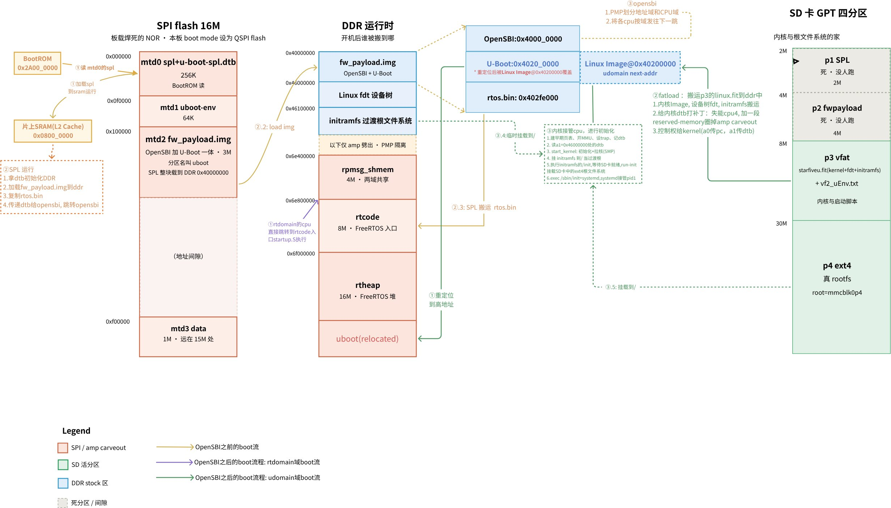
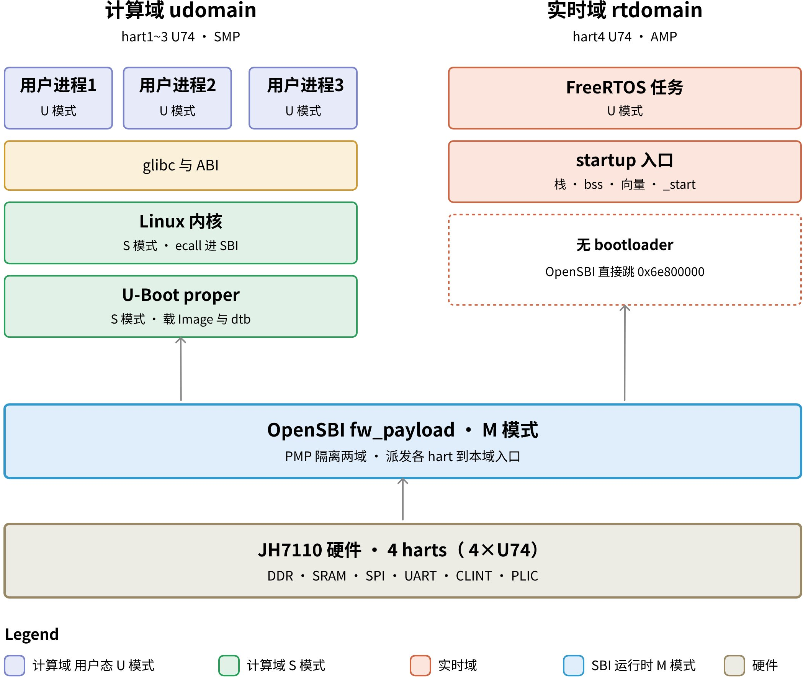
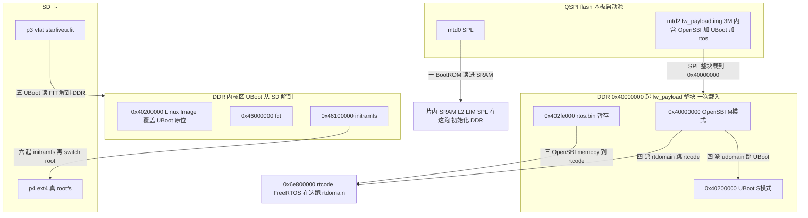

## 参考资料

[JH-7110 Boot User Guide](https://doc-en.rvspace.org/VisionFive2/Boot_UG/)

## boot流程

### 总体启动流程

### 实际启动流程

## boot地址分配

### SPI flash

| dev | 起始偏移 | 大小 | 名字 | 装的东西 |
|-|-|-|-|-|
| mtd0 | 0x000000 | 0x040000 (256K) | "spl" | SPL（u-boot-spl.bin.normal.out） |
| mtd1 | 0x0f0000 | 0x010000 (64K) | "uboot-env" | U-Boot 环境变量 |
| mtd2 | 0x100000 | 0x300000 (3M) | "uboot" | fw_payload = OpenSBI + U-Boot proper |
| mtd3 | 0xf00000 | 0x100000 (1M) | "data" | 杂项（远在 15M 处，不与上面相邻） |

<callout emoji="📌">
mtd2 分区名叫 uboot，但装的不是 U-Boot——是 fw_payload.img = OpenSBI + U-Boot 打包成的一个文件（OpenSBI 在外、U-Boot 嵌在里头）。
</callout>

- 偏移来自板上 /sys/class/mtd/mtdN/offset，大小来自 /proc/mtd，两者一致。
- **SPL 必须 ≤ mtd0 的 256K**，且受 SoC SRAM 限制更紧（实际上限 180048 字节）。
- **fw_payload 必须 ≤ mtd2 的 3M（0x300000）**——这是 amp 给 cpu4 塞 RTOS 时撞到的尺寸墙。
- 但 3M 是这块板 MTD 分区表划的，**不是物理硬限**：官方 Boot UG 的 SDK 推荐布局给 fw_payload 区 4M（0x100000 到 0x500000，Reserved 从 0x600000 起），本板 vendor 只把 mtd2 划了 3M。两套布局的 env（0xF0000）、fw_payload 起点（0x100000）一致，只是区段大小不同。含义：flashcp /dev/mtd2 受分区表 3M 限，但若按官方 4M 布局裸写 offset 0x100000，物理上能放到 4M——amp 当初瘦身到 3M 内，其实还有 4M 余地。

### SD 卡 —— 内核 + 根文件系统的家

| 分区 | 偏移 | 大小 | 内容 | 本板是否真用 |
|-|-|-|-|-|
| p1 | 2M | 2M | SPL | ✗（板从 SPI 启，这份没人跑） |
| p2 | 4M | 4M | fw_payload | ✗（同上） |
| p3 | 8M | \~ | vfat：starfiveu.fit + uEnv | ✓ 内核 / 启动脚本从这读 |
| p4 | 30M | 剩余 | ext4 真 rootfs | ✓ root=/dev/mmcblk0p4 |

- root=/dev/mmcblk0p4 来自板上 cat /proc/cmdline 实测；findmnt / 实测 / = /dev/mmcblk0p4 ext4。
- **p1/p2 是 make img 出 sdcard.img 时无脑带上的**，在"从 SPI 启动"的板子上是死分区。别被它们误导成"板子从 SD 启 bootloader"。

### DDR 运行时

<table><colgroup><col/><col/><col/></colgroup><thead><tr><th vertical-align="top">地址</th><th vertical-align="top">内容</th><th vertical-align="top">谁搬的 / 说明</th></tr></thead><tbody><tr><td vertical-align="top">0x4000_0000</td><td vertical-align="top">fw_payload 载入区</td><td vertical-align="top">SPL 把 mtd2 的 OpenSBI+U-Boot 载到这</td></tr><tr><td vertical-align="top">0x4020_0000</td><td vertical-align="top">内核 Image</td><td vertical-align="top">U-Boot 解压 vmlinux 到这（也是 udomain next-addr）</td></tr><tr><td vertical-align="top">0x4600_0000</td><td vertical-align="top">设备树 fdt</td><td vertical-align="top">U-Boot 载 FIT 里的 fdt 到这</td></tr><tr><td vertical-align="top">0x4610_0000</td><td vertical-align="top">initramfs</td><td vertical-align="top">U-Boot 载 FIT 里的 ramdisk 到这</td></tr><tr><td colspan="3" vertical-align="top">—— 以下是 amp carveout（只有 amp 固件才劈出来，PMP 硬隔离）——</td></tr><tr><td vertical-align="top">0x6e40_0000</td><td vertical-align="top">rpmsg_shmem  4MB</td><td vertical-align="top">两域共享窗口（OpenAMP vring+buffer）</td></tr><tr><td vertical-align="top">0x6e80_0000</td><td vertical-align="top">rtcode       8MB</td><td vertical-align="top">FreeRTOS 代码（rtdomain 入口）</td></tr><tr><td vertical-align="top">0x6f00_0000</td><td vertical-align="top">rtheap      16MB</td><td vertical-align="top">FreeRTOS 堆</td></tr></tbody></table>

- 0x40200000 / 0x46000000 / 0x46100000 三个 load 地址直接抄自 conf/visionfive2-fit-image.its:14,33,25。
- 0x40000000 是 fw_payload 的 load（conf/visionfive2-uboot-fit-image.its 里 firmware 镜像的 load）。
- carveout 三段来自 u-boot/arch/riscv/dts/starfive_jh7110-amp.dts:20-39，stock 启动**没有**这块（全 4G 归 Linux）。

## 系统架构

---

## 系统架构 + 启动流程总览（补充）

<callout emoji="📌">
以下内容追加自本地 dev-log boot-architecture，所有地址 / 偏移 / 结构均为真板实测（readelf · /proc/mtd）+ 源码 file:line 对证；boot mode / SPI 布局据官方 JH7110 Boot UG 校正。与上文若有重叠以本节的细化版为准，上文内容保持不动。
</callout>

### 一句话总开关

**bootloader 三件套（SPL / OpenSBI / U-Boot）在 qspi flash；内核和根文件系统在 SD 卡。**这块板的 boot mode 设成 QSPI flash，所以从 qspi 启、不从 SD——SD 上 make img 带的 SPL / fw_payload（p1 / p2）永远没人跑（amp 烧 SD 不分流就栽在这，见 amp-smoke 复盘 · 记忆 vf2-boot-from-spi）。

**启动链一图**（总图）：

### 东西都存在哪（三种介质，全部实测）

#### qspi flash 16M（cat /proc/mtd 实测）

| dev | 偏移 | 大小 | 名字 | 装的东西 |
|-|-|-|-|-|
| mtd0 | 0x000000 | 256K | spl | SPL + 控制 dtb（俩拼成一个 .normal.out） |
| mtd1 | 0x0f0000 | 64K | uboot-env | U-Boot 环境变量 |
| mtd2 | 0x100000 | 3M | uboot | fw_payload.img = OpenSBI + U-Boot（分区名误导，见下文 fw_payload 内部） |
| mtd3 | 0xf00000 | 1M | data | 杂项（远在 15M 处） |

<callout emoji="📌">
mtd2 那 3M 是这块板分区表划的，不是物理硬限：官方 SDK 布局给 fw_payload 区 4M（0x100000\~0x500000）。flashcp /dev/mtd2 受 3M 限，裸写 offset 0x100000 物理可到 4M——amp 当初瘦身到 3M 内其实有余地。
</callout>

#### SD 卡 GPT（来源 conf/genimage-vf2.cfg）

| 分区 | 偏移 | 内容 | 本板真用？ |
|-|-|-|-|
| p1 | 2M | SPL | ✗ 死分区（板从 qspi 启） |
| p2 | 4M | fw_payload | ✗ 死分区 |
| p3 | 8M | vfat：starfiveu.fit + vf2_uEnv.txt | ✓ 内核 / 启动脚本从这读 |
| p4 | 30M | ext4 真 rootfs | ✓ root=/dev/mmcblk0p4（实测 findmnt /） |

#### boot mode 怎么选的（官方 Boot UG）

BootROM 固化在 0x2A000000，读 AON_RGPIO[1,0]（寄存器 0x1702002c）两个引脚定 boot mode：

| boot mode | RGPIO_1 | RGPIO_0 | BootROM 从哪取 SPL |
|-|-|-|-|
| QSPI Nor Flash（本板） | 0 | 0 | qspi flash Sector 0 |
| SDIO3.0（SD 卡） | 0 | 1 | SD |
| eMMC | 1 | 0 | eMMC |
| UART | 1 | 1 | UART0 xmodem（救砖） |

<callout emoji="💡">
VF2 能从 SD 启 bootloader（设 RGPIO 0,1），只是本板默认 QSPI flash——amp 的“改 SD 启动”方案官方层面可行，卡的是 VF2 Lite 这俩引脚怎么物理设。
</callout>

### fw_payload 内部长啥样（readelf 实测）

mtd2 分区名叫 uboot，但装的不是 U-Boot——是 fw_payload.img，OpenSBI 把 U-Boot 当自己的一个 .payload section 嵌在固定 2MB 偏移处。证据（readelf -S fw_payload.elf + nm）：

| section | 运行地址 | 内容 |
|-|-|-|
| .text | 0x40000000 | OpenSBI 代码入口 |
| .rodata | 0x40016000 | OpenSBI |
| .data | 0x40040000 | OpenSBI |
| .payload | 0x40200000 | U-Boot proper（符号 payload_bin） |

因为以 FW_TEXT_START=0x40000000 为基址 objcopy 成二进制，文件偏移 = 运行地址 − 0x40000000：

| 文件偏移 | 运行地址 | 是什么 |
|-|-|-|
| 0x000000 | 0x40000000 | OpenSBI（M 模式），本体只占前面一小段，其余填零对齐到 2M |
| 0x200000 | 0x40200000 | U-Boot proper（S 模式），约 1M |
| 0x2fb638 | 0x402fb638 | 纯 stock fw_payload 到此结束（实测 2.98M） |
| 0x2fe000 | 0x402fe000 | [amp 版] 拼接的 rtos.bin（FreeRTOS 载荷） |

这顺手解释了两个地址：① U-Boot 为什么在 0x40200000——是 .payload 按 2MB 对齐嵌的，也是 OpenSBI 跳 U-Boot 的 next-addr；② amp 的 rtos 为什么拼在尾部 0x2fe000——U-Boot 之后的空位。OpenSBI 启动末尾不读盘，直接跳自己 section 里的 payload_bin。

### 开机时每样东西：存哪 → 谁搬 → 落哪（搬运总账）

先按“东西”看一眼归宿（5 样，一眼看全）：

| 东西 | 静态存在哪 | 谁加载、哪一步 | 落到哪 |
|-|-|-|-|
| SPL + u-boot-spl.dtb（俩拼成一个文件） | qspi mtd0 0x0 | BootROM（第 0 步） | 片内 SRAM |
| fw_payload（OpenSBI+U-Boot+rtos） | qspi mtd2 0x100000 | SPL（第 1 步） | DDR 0x40000000 |
| rtos（本在 fw_payload 内 0x402fe000） | 随 fw_payload 在 DDR | SPL 的 fixup（第 1 步）memcpy | DDR 0x6e800000 |
| Linux 镜像 + fdt + initramfs（打包在一个 FIT 里） | SD p3 starfiveu.fit | U-Boot（第 4 步）fatload+bootm | Image→0x40200000 / fdt→0x46000000 / initramfs→0x46100000 |
| 真 rootfs | SD p4 ext4 | 不加载，switch_root 挂载（第 5 步） | 留在卡上 |

整个开机只有 **8 次真搬运**（把上表第 4 行的 FIT 拆开、再加 U-Boot 自己 relocate）：

| # | 搬什么 | 从哪 | 到哪 | 谁搬 | 哪步 |
|-|-|-|-|-|-|
| 1 | SPL + 控制 dtb | qspi mtd0 0x0 | 片内 SRAM（L2 LIM 0x08000000） | BootROM | 上电 |
| 2 | fw_payload 整块 | qspi mtd2 0x100000 | DDR 0x40000000 | SPL | 1 |
| 3 | rtos | DDR 0x402fe000（fw_payload 内） | DDR 0x6e800000（rtcode） | SPL 的 fixup | 1 |
| 4 | U-Boot relocate 自己 | DDR 0x40200000 | DDR 高处（接近内存顶） | U-Boot | 3 |
| 5 | 整个 starfiveu.fit | SD p3（vfat） | DDR 临时（loadaddr） | U-Boot fatload | 4 |
| 6 | 内核 Image（顺带解压） | FIT 内 | DDR 0x40200000（#4 腾出） | U-Boot bootm | 4 |
| 7 | fdt | FIT 内 | DDR 0x46000000 | U-Boot bootm | 4 |
| 8 | initramfs | FIT 内 | DDR 0x46100000 | U-Boot bootm | 4 |

<callout emoji="💡">
#3 的 memcpy 在 u-boot/board/starfive/visionfive2/spl.c 的 spl_perform_fixups，SPL 载完 fw_payload、跳 OpenSBI 之前做。#5 是两跳：先 fatload 整个 FIT 进 DDR，再 bootm 把 #6/#7/#8 摆到各自 load 地址（地址来自 conf/visionfive2-fit-image.its）。
</callout>

明确“不搬”的（免得误解）：

| 东西 | 为啥不搬 |
|-|-|
| 控制 dtb 给 OpenSBI | 不复制，只把它在 SRAM 的地址塞 a1 递过去；OpenSBI 再把地址往下递给 U-Boot。全程原地 |
| 真 rootfs（SD p4） | 不搬。switch_root 把 SD p4 当块设备挂到 /，运行时按需读（page cache 缓存热文件），从不整盘进 DDR |
| rtheap 0x6f000000 | 空着。FreeRTOS 运行后自己拿它当堆（栈/malloc） |
| rpmsg_shmem 0x6e400000 | 空着。M3 接门铃后、运行时通信才往里写 vring/buffer |

<callout emoji="📌">
carveout 里只有 rtcode 被搬过数据（SPL 搬 rtos 进去）；rtheap / rpmsg 始终空白，等运行时用。
</callout>

### 从上电到 systemd，逐步发生什么

文字版六步：

1. **SPL 收尾**：fw_payload 一落地，SPL（不是 OpenSBI）先把 0x402fe000 的 rtos memcpy 到 0x6e800000（rtcode），再跳 0x40000000 交棒 OpenSBI，把控制 dtb 地址塞 a1 递过去。
2. **OpenSBI 划域 + 分发（分叉点）**：OpenSBI 在 0x40000000（M 模式）读 a1 的 dtb，见 opensbi-domains，用 PMP 把核 + 内存劈成 udomain（cpu1-3 → 0x40200000）/ rtdomain（cpu4 → 0x6e800000），硬隔离 carveout，然后把两域 boot-hart 各派往下一跳——从这刻起两条线并行。

**计算域（cpu1-3，Linux）：**

1. **U-Boot（S 模式 @0x40200000）**：从 SD p3 读 starfiveu.fit + vf2_uEnv.txt。
2. **U-Boot 摊内核到 DDR**：内核 Image→0x40200000（它早已 relocate 到内存高处，这儿腾给内核）、fdt→0x46000000、initramfs→0x46100000；amp 版顺手给内核 dtb 打补丁（关 cpu4 + 加 reserved-memory），然后 booti。
3. **内核 Image 拿到 cpu 后**：从 0x40200000 的 \_start（S 模式）起跑 → 建页表开 MMU、读 0x46000000 的 dtb → start_kernel 初始化 → SBI HSM 拉起 cpu2/cpu3（cpu4 被 dtb 标 disabled，跳过；就算想拉，OpenSBI 域隔离也会拒）→ 按 reserved-memory 避开 carveout → 挂 0x46100000 的 initramfs 当过渡根跑 /init。
4. **切真根**：/init 读 root=/dev/mmcblk0p4，等 SD 就绪，run-init（switch_root）切到 SD p4 ext4，exec 真根的 /sbin/init = systemd 接管 PID1。

**实时域（cpu4，RTOS，与上并行）：**

3'. cpu4 被 OpenSBI 直接扔到 0x6e800000（SPL 第 1 步搬来的那段）——没有 bootloader、不读盘。入口 startup：架栈、清 bss、设向量 → 进 FreeRTOS，拿 0x6f000000（rtheap）当堆，点 UART2。（M1 到此为止；M3 才接 0x6e400000 的 rpmsg 共享窗口。）

### 几份设备树，分别给谁用

启动链里不止一份 dtb，每级一份，给不同的人——别把“控制 dtb”和“内核 fdt”当一份：

| 设备树 | 在哪 | 谁用 | 干嘛 |
|-|-|-|-|
| 控制 dtb（u-boot-spl.dtb，fdtgrep 裁过的小份，拼在 SPL 尾） | 片内 SRAM | SPL + OpenSBI | SPL 拿它初始化 DDR、找 payload；OpenSBI 拿它读 opensbi-domains 划域 |
| Linux fdt（FIT 里那份完整 dtb） | DDR 0x46000000 | Linux 内核 | 知道 CPU/内存/外设/cmdline/reserved-memory/cpu4 disabled，驱动整个系统 |

<callout emoji="💡">
OpenSBI build 时也内置一份 dtb（FW_FDT），但实际用的是 a1 递来的 SPL 控制 dtb，不是内置那份（amp-smoke 实测）。
</callout>

关键：这两份连源码都不是一棵树——控制 dtb 来自 U-Boot 树 u-boot/arch/riscv/dts/starfive_jh7110-amp.dts（那段 opensbi-domains）；Linux fdt 来自 Linux 树 linux/arch/riscv/boot/dts/starfive/jh7110-\*.dtb。这就是 amp 要在两处各改一次的原因：想让 OpenSBI 真劈核 → 改 U-Boot 树那份；想让 Linux 干净启动（不碰 cpu4 / carveout）→ 改 Linux 那份（uEnv 在前文第 4 步 fdt set）。

### amp 在内存上做了什么、什么时候做

carveout 三段地址是 amp dts 设计时写死的（starfive_jh7110-amp.dts:20-39）：0x6e400000 rpmsg_shmem 4M（两域共享）/ 0x6e800000 rtcode 8M（FreeRTOS 入口）/ 0x6f000000 rtheap 16M。但“划”和“搬”是三个不同阶段的事：

| amp 动作 | 哪步 | 干啥 |
|-|-|-|
| 把 rtos 搬进 rtcode | SPL，第 1 步 | 只是 memcpy 搬数据放着，还没“划” |
| **划域 + PMP 硬隔离 carveout** | OpenSBI，第 2 步 | ★真正“开始划”：读 opensbi-domains，PMP 圈成 udomain/rtdomain |
| 给 Linux 加 reserved-memory + 关 cpu4 | U-Boot，第 4 步 | 不是划，是通知 Linux“这几块别碰” |

<callout emoji="📌">
在 OpenSBI 第 2 步之前，整个 DDR 是平的、没有域、谁都能访问。carveout 地址一开始就定了，但真正被隔离是 OpenSBI 用 PMP 落实的。
</callout>
